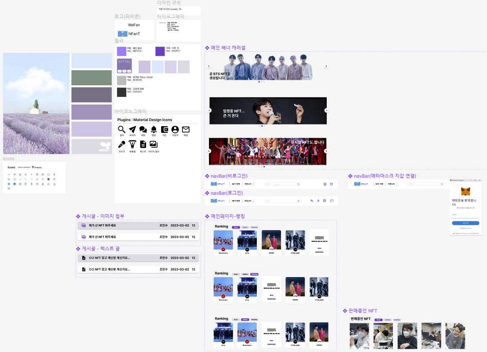
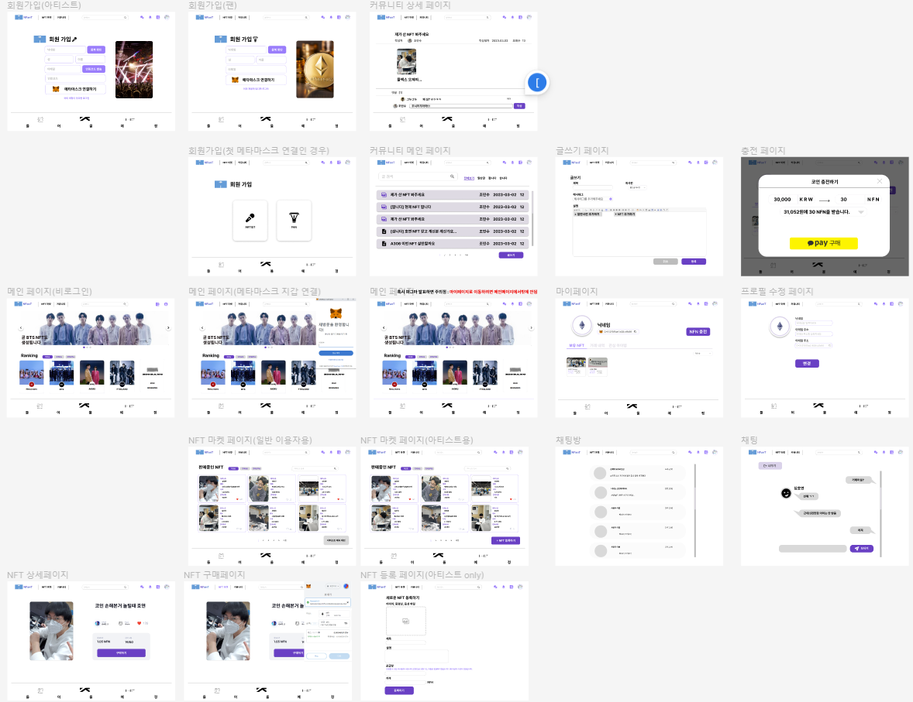
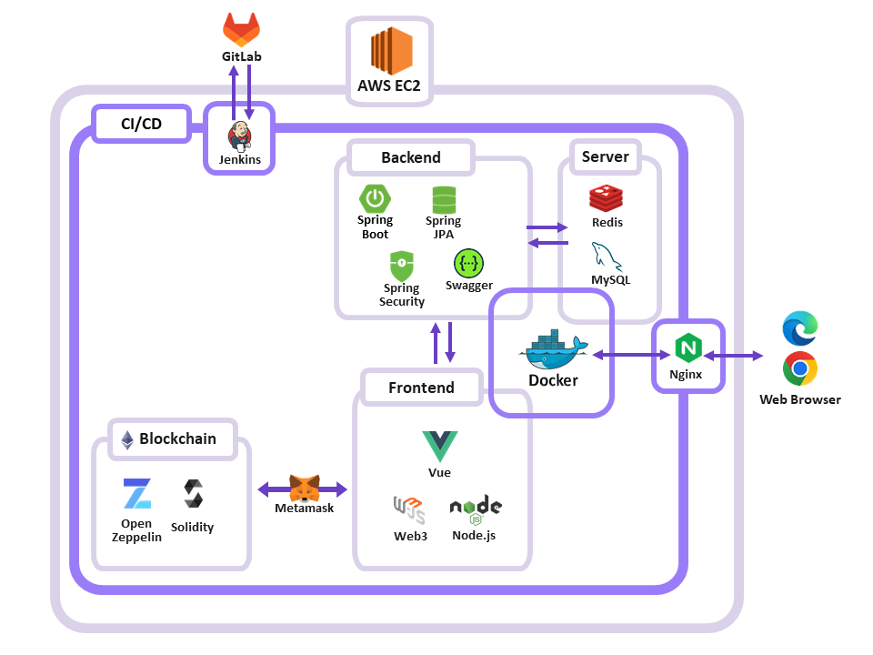
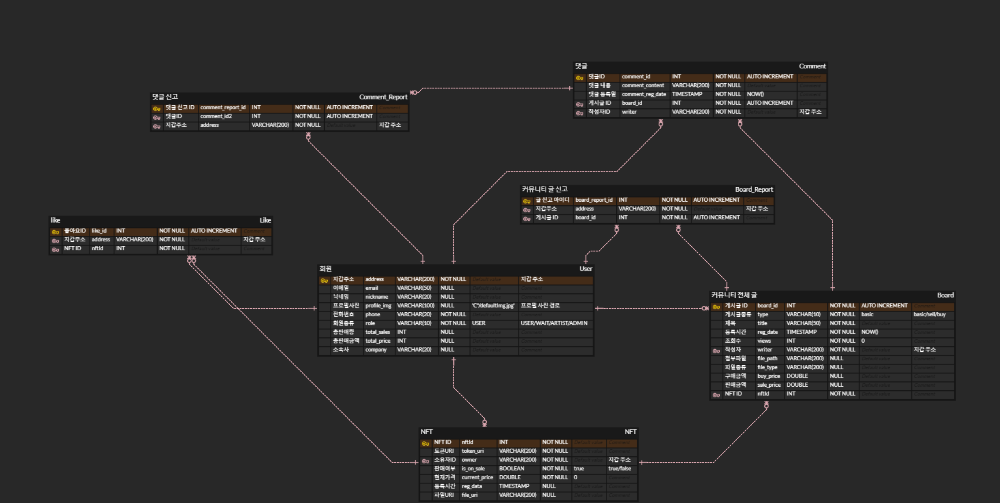

# 아티스트 굿즈 자유거래 플랫폼

---

## 와이어 프레임(프로토타입)

---

## 와이어 프레임 - 디자인 시스템

## 와이어 프레임 - 작업본

2023-03-07 \~ 2023-03-08 동안 피그마 작업 완료(신선호, 장근우)

- 위의 목업에 기반하여 FrontEnd 개발 예정

- BackEnd 팀(김성환, 고민수, 최현제)은 기능명세서 및 ERD 작성 중

- 블록체인 기술팀(심호연)은 기술 학습 중

---

## 아키텍처

---

## ERD 작업

컨설턴트님과의 회의 뒤 ERD 수정.
